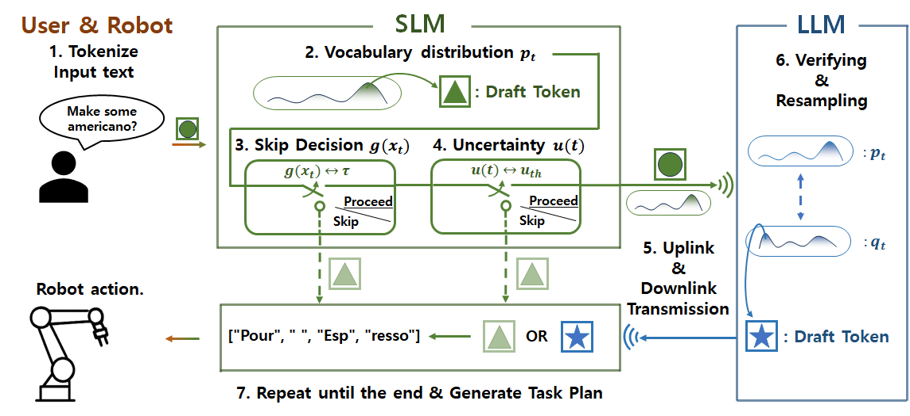

<h1 style="text-align: center;">Uncertainty-Aware Opportunistic Hybrid Language Model   in Wireless Robotic Systems</h1>

  Jeyoung Park1, Yeonsub Lim2, Seungeun Oh2,
  Jihong Park3, Jinho Choi4, Seong-Lyun Kim2

  University of Waterloo1, Yonsei University2, Singapore University of Technology and Design3, University of Adelaide4

  <a href="https://arxiv.org/abs/2407.02666"
     style="
       display: inline-block;
       padding: 0.6em 1.2em;
       background-color: #24292e;
       color: #fff;
       border-radius: 9999px;
       text-decoration: none;
       font-weight: bold;
       margin-right: 0.5em;
     ">
    📄 Paper
  </a>
  <a href="https://github.com/jeyoung78/Robot-Barista"
     style="
       display: inline-block;
       padding: 0.6em 1.2em;
       background-color: #24292e;
       color: #fff;
       border-radius: 9999px;
       text-decoration: none;
       font-weight: bold;
     ">
    💻 Code
  </a>

<h2 style="text-align: center; font-size: 1.5em; margin-top: 2em;">
Abstract
</h2>

The hybrid language model (HLM) is an emerging architecture that efficiently distributes computation between on-device small language models (SLMs) and remote large language models(LLMs). In HLM, an SLM drafts tokens and its paired LLM validates and refines them, thereby achieving higher token throughput than LLMs and higher inference accuracy than SLMs. Recently, the uncertainty-aware opportunistic HLM has been proposed to improve communication and computation efficiency by skipping LLM verification when the SLM’s uncertainty is low. However, this approach has only been evaluated on simple text prediction tasks under a statistical channel model for theoretical analysis. To validate the practical feasibility of U-HLM, in this paper, we implement U-HLM on a real-world robot testbed, where an industrial-grade robotic manipulator (high-precision robot arm with gripper) runs an SLM and communicates with a remote LLM over Wi-Fi. In this experimental setup, we observe that computing uncertainty itself incurs non-negligible latency. To mitigate this, we propose a conditional uncertainty calculation omission method, which skips the uncertainty calculation when a lightweight logistic regression model predicts the uncertainty to be sufficiently low. Experimental results show that, compared to HLM, the proposed U-HLM improves token throughput by 24.9% and 41.8% under strong and weak Wi-Fi coverage conditions, respectively, while maintaining a 98.11% F1 score.

<h2 style="text-align: center; font-size: 1.5em; margin-top: 2em;">
Hybrid Language Model & Robot Testbed
</h2>

In this proof-of-concept study to verify U-HLM’s effectiveness on an actual wireless network and as a robotic task planner, we implement a testbed consisting of the following three main components: a laptop (local device), a remote server, a the robot, connected over a wireless network, as shown in Figure. U-HLM deployed on the testbed serves as a task planner, generating sequences of action-object pairs corresponding to given natural language orders to be performed by the robot.

  Experimental Setup

  <!-- 왼쪽 블록 -->
  

    
    

The local SLM, Tiny-Llama 1.1B, executes on a Windows-based laptop, serving as the local device, equipped with a 6-core Intel Core i7-10750H CPU, 8 GB of DDR4 RAM, and an NVIDIA GeForce GTX 1650 Ti GPU connected to IEEE 802.11ac Wi-Fi on a 5 GHz band, whereas the remote LLM, Llama 27B, runs on a Linux server featuring an 8-core Intel Xeon Silver 4215R CPU, 64 GB of DDR4 RAM, and three NVIDIA GeForce RTX 3090 GPUs, connected to Ethernet. A Doosan A0912s robot arm equipped with a GEP2016IO-00-A gripper interfaces with the same Wi-Fi network directly with the laptop. Both the SLM and the LLM are finetuned with LoRA to produce  tructured and executable task sequences consisting of action-object pairs for a given natural language order. 
    

  

  <!-- 오른쪽 블록 -->
  

    
    

During inference, each draft token generated by SLM is paired with its vocabulary distribution, serialized as a JSON object, and sent from the laptop to the LLM server via a Flask REST endpoint over the Wi-Fi link. The network switch forwards this JSON payload over Ethernet to the server where the verification and probabilistic resampling of the draft token occur before returning the finalized token— again as a JSON object via Flask—over Ethernet and Wi-Fi back to the laptop. Once all tokens are generated to form a complete task plan, the laptop sends it in a single JSON batch again via Flask over Wi-Fi to the robot.
    

  

