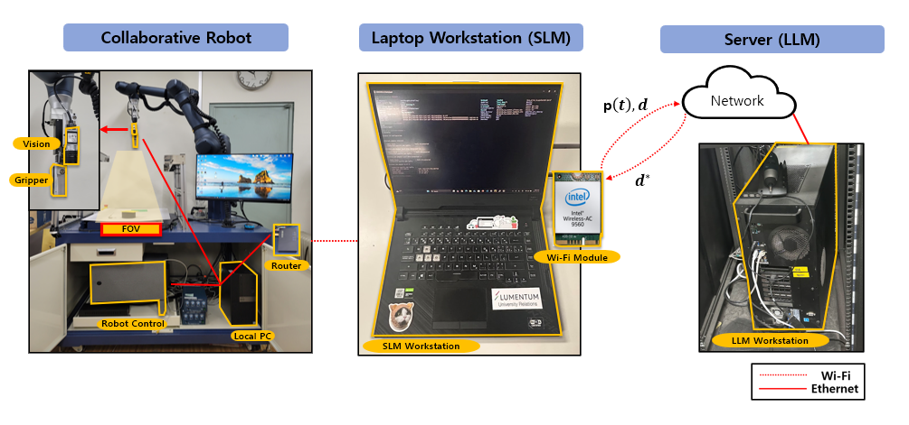

<h1 style="text-align: center;">Uncertainty-Aware Opportunistic Hybrid Language Model <br> in Wireless Robotic Systems</h1>

<p align="center" style="font-size: 0.9em; color: #555; margin-top: 0.2em;">
  Jeyoung Park<sup>1</sup>, Yeonsub Lim<sup>2</sup>, Seungeun Oh<sup>2</sup>,
  Jihong Park<sup>3</sup>, Jinho Choi<sup>4</sup>, Seong-Lyun Kim<sup>2</sup>
</p>

<p align="center" style="font-size: 0.9em; color: #555; margin-top: 0.2em;">
  University of Waterloo<sup>1</sup>, Yonsei University<sup>2</sup>, Singapore University of Technology and Design<sup>3</sup>, University of Adelaide<sup>4</sup>
</p>
<p align="center" style="margin: 1em 0;">
  <a href="https://arxiv.org/abs/2407.02666"
     style="
       display: inline-block;
       padding: 0.6em 1.2em;
       background-color: #24292e;
       color: #fff;
       border-radius: 9999px;
       text-decoration: none;
       font-weight: bold;
       margin-right: 0.5em;
     ">
    📄 Paper
  </a>
  <a href="https://github.com/jeyoung78/Robot-Barista"
     style="
       display: inline-block;
       padding: 0.6em 1.2em;
       background-color: #24292e;
       color: #fff;
       border-radius: 9999px;
       text-decoration: none;
       font-weight: bold;
     ">
    💻 Code
  </a>
</p>
<h2 style="text-align: center; font-size: 1.5em; margin-top: 2em;">
Abstract
</h2>



<div style="max-width: 1000px; margin: 1 auto;">
The hybrid language model (HLM) is an emerging architecture that efficiently distributes computation between on-device small language models (SLMs) and remotel arge language models(LLMs). In HLM, an SLM drafts tokens and its paired LLM validates and refines them, thereby achieving higher token throughput than LLMs and higher inference accuracy than SLMs. Recently, the uncertainty-aware opportunistic HLM has been proposed to improve communication and computation efficiency by skipping LLM verification when the SLM’s uncertainty is low. However, this approach has only been evaluated on simple text prediction tasks under a statistical channel model for theoretical analysis. To validate the practical feasibility of U-HLM, in this paper, we implement U-HLM on a real-world robot testbed, where an industrial-grade robotic manipulator (high-precision robot arm with gripper) runs an SLM and communicates with a remote LLM over Wi-Fi. In this experimental setup, we observe that computing uncertainty itself incurs non-negligible latency. To mitigate this, we propose a conditional uncertainty calculation omission method, which skips the uncertainty calculation when a lightweight logistic regression model predicts the uncertainty to be sufficiently low. Experimental results show that, compared to HLM, the proposed U-HLM improves token throughput by 24.9% and 41.8% under strong and weak Wi-Fi coverage conditions, respectively, while maintaining a 98.11% F1 score.

## Hardware Setup

1. Print the mount listed as `frontmount v9.stl` using a 3D printer of your choice (PLA should be fine). Mount your camera into the protected space on the front of the mount, and then mount the assembly through the neck holes of the robot, such that the camera mount hangs over the robot's head.

4. Chose one of your Go1 Edu's Nanos. Use a USB hub to connect this Nano to a USB wifi adapter and the realsense camera on the front of the robot.


## Installation

1. Clone this repo to your chosen Nano on your Go1 Edu (Here we will assume you are using Nano3 at 192.168.123.15)

```
git clone https://github.com/stanford-iris-lab/vlm-pc.git
cd vlm-pc
```

2. Create a new mamba environment running Python 3.8. Using the conda-forge channel may be helpful to resolve combatability issues with the architecture of the Nano

```
mamba create -n vlmpc python=3.8
mamba activate vlmpc
```
3. Install dependencies via `pip`
```
pip install pyrealsense2==2.55.1.6486
pip install pillow==10.3.0
pip install numpy
```

## Running and Configs

To run VLM-PC with default settings, run
```
python run_hl.py --logdir experiment_name
```
To make a custom command configuration for the Go1 Controller, make a new json file in `configs/commands` in the format of `default.json`. Then use `python run_hl.py --command_config` to use the new command profile.

To make a custom controller profile (for example, to use custom prompts or use a custom ICL dataset), make a new json file in `configs/controller` with edited prompts. Then use `python run_hl.py --control_config` to use this new config file. The config files included in `configs/controller` implement VLM-PC and all the ablations described in the paper. 

To specify a new ICL dataset, make a new folder with ICL images (see `configs/icl` as an example). Name each image with the possible commands to use in each scenario separated by `_`. Then add `"icl": directory/of/new/icl/dataset` to the controller config json file to use this dataset. Also add `<ICL>` to the location in the openning query prompt where you want to include the ICL datset. See `configs/controller/trials_history_plan_icl.json` as an example of the syntax for this.
